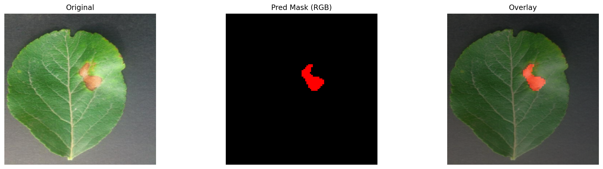

# 苹果叶病害识别与分割系统

基于 `Streamlit + PyTorch` 的苹果叶病害识别 Web 应用，支持病害分类、病斑分割、可视化展示与像素占比统计。

## 在线体验

- 在线地址: [http://43.133.217.136:8501](http://43.133.217.136:8501)

如果你只是想直接使用系统，优先打开上面的线上地址即可。

## 项目截图



## 功能特点

- 9 类苹果叶病害分类
- 病斑区域分割
- Top-3 分类结果展示
- 彩色 Mask 与叠加可视化
- 病斑像素占比统计
- 支持 CPU 推理
- 支持 Ubuntu + `systemd` 部署

## 支持的分类类别

- Alternaria leaf spot
- Brown spot
- Frogeye leaf spot
- Grey spot
- Health
- Mosaic
- Powdery mildew
- Rust
- Scab

## 直接下载模型

本仓库代码与模型分开管理，但模型提供了直接下载入口。下载后放到 `models/` 目录即可运行。

- 分类模型: [vit_resnet_multi_task_model.pth](https://github.com/fy738783180/appleleaf-disease-system/releases/latest/download/vit_resnet_multi_task_model.pth)
- 分割模型: [ld_deeplabv3plus_best_model_3.pth](https://github.com/fy738783180/appleleaf-disease-system/releases/latest/download/ld_deeplabv3plus_best_model_3.pth)

## 项目结构

```text
appleleaf-disease-system/
├─ app.py
├─ requirements.txt
├─ assets/
│  └─ screenshots/
│     └─ demo-panel.png
├─ deployment/
│  ├─ appleleaf-streamlit.service
│  └─ DEPLOYMENT.md
└─ models/
   └─ README.md
```

## 本地运行

1. 创建虚拟环境

```bash
python -m venv venv
```

2. 激活虚拟环境

```bash
# Windows
venv\Scripts\activate

# Linux / macOS
source venv/bin/activate
```

3. 安装依赖

```bash
pip install --upgrade pip
pip install torch torchvision
pip install -r requirements.txt
```

4. 下载模型并放到 `models/` 目录

```text
models/
├─ vit_resnet_multi_task_model.pth
└─ ld_deeplabv3plus_best_model_3.pth
```

5. 启动应用

```bash
streamlit run app.py
```

6. 浏览器访问

```text
http://127.0.0.1:8501
```

## 服务器部署

该项目已经完成 Ubuntu Server 24.04 的实际部署验证，适合使用 `systemd` 长期运行。

完整部署说明见:

[deployment/DEPLOYMENT.md](deployment/DEPLOYMENT.md)

## 模型路径说明

默认模型路径:

- `models/vit_resnet_multi_task_model.pth`
- `models/ld_deeplabv3plus_best_model_3.pth`

也支持使用环境变量覆盖:

```bash
export CLS_MODEL_PATH=/your/path/vit_resnet_multi_task_model.pth
export SEG_MODEL_PATH=/your/path/ld_deeplabv3plus_best_model_3.pth
```

## 适合添加到 GitHub 的 Topics

`streamlit` `pytorch` `computer-vision` `image-segmentation` `plant-disease` `apple-leaf` `deep-learning`

## 作者

涛哥
